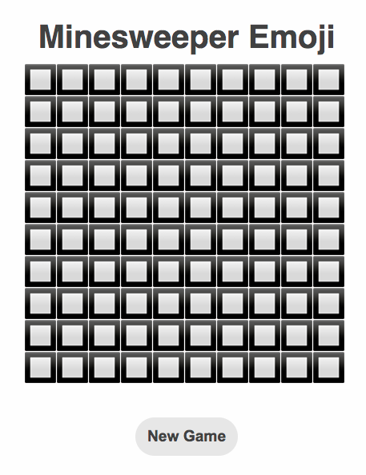
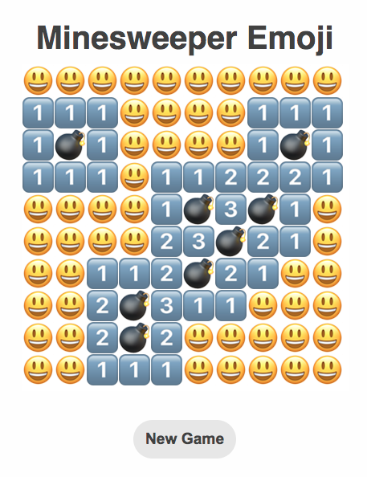
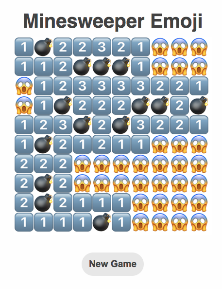
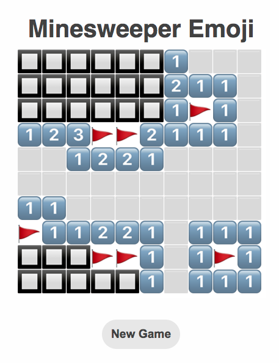
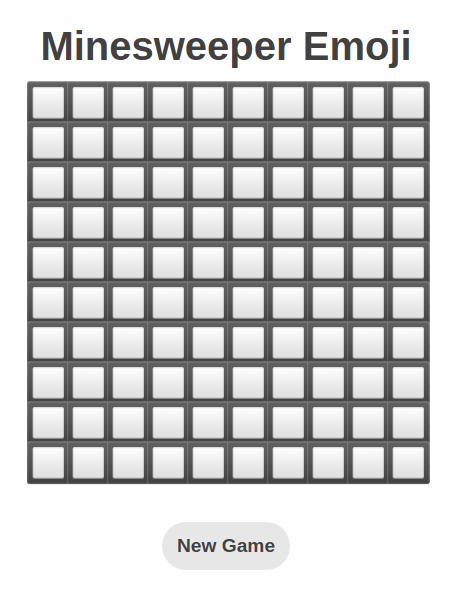
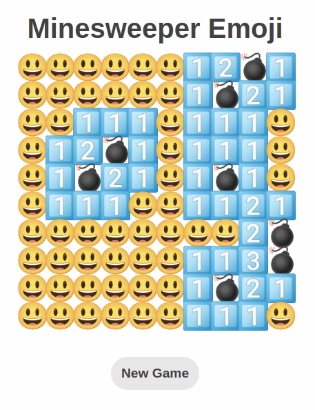

  
   
  

<h3 align="center">Minesweeper made with 😃 😵 💣 🚩 and ❤️  <a target="_blank" href="https://minesweeper-emoji.netlify.app/">Try me!</a><h3>

  
  
## Technologies Used

&nbsp;&nbsp;&nbsp;&nbsp;&nbsp;&nbsp;

&nbsp;&nbsp;&nbsp;&nbsp;&nbsp;&nbsp;

&nbsp;&nbsp;&nbsp;&nbsp;&nbsp;&nbsp;

&nbsp;&nbsp;&nbsp;&nbsp;&nbsp;&nbsp;

  
  
## Description
The classic Minesweeper game reimagined and implemented with emojis. It is an example of object-based JavaScript, each Cell is an instance of the class Cell. Mines are allocated randomly on page load. 
  
  
  
## Controls
  
* Left-click to reveal cell 
* Right-click to flag
* New Game button restarts the game

  
  
## Screenshots:

### Windows
  
#### Win

  
#### Loss  

  
### macOS
 
#### Start

  
#### Win

#### Loss

#### Playing

  
### Linux (Ubuntu)

#### Start

  
#### Win

 
 

<strong>Note:</strong> You might have noticed that the game looks differently on each platform. This is because of the fact that macOS and Linux/Windows use different default system fonts, thus emojis are rendered differently on each platform. It is possible that in your machine the game doesn't look like the screenshots because of your system fonts.
  

  
## To-do list
  
* ~~New Game button~~ 
* Mines counter 
* Time counter 
* Moves counter 
* Sane(r) mine allocation system
* Allocate mines on first click to avoid clicking on a mine
* Twemoji version

  
  
## Related Projects

[Tic-Tac-Toe](https://github.com/michaelkolesidis/tic-tac-toe)  
  
  
  
## License

Copyright (c) 2021-2022 Michael Kolesidis 
Licensed under the [GNU General Public License v3.0](https://github.com/michaelkolesidis/webproject-script/blob/main/LICENSE).
  

  
[//]: # (Free Software)

   
   

  

                                                       

  

