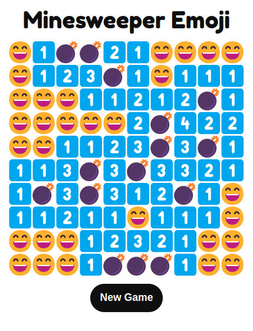
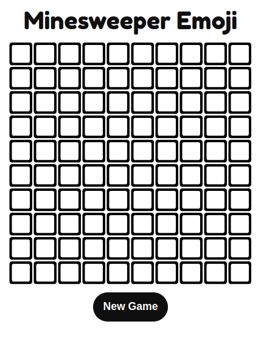

  
   
  

<h3 align="center">Minesweeper made with 😄 😵 💣 🚩 and ❤️  <a target="_blank" href="https://minesweeper-emoji.netlify.app/">Try me!</a><h3>

  
  
## Technologies Used

&nbsp;&nbsp;&nbsp;&nbsp;&nbsp;&nbsp;

&nbsp;&nbsp;&nbsp;&nbsp;&nbsp;&nbsp;

&nbsp;&nbsp;&nbsp;&nbsp;&nbsp;&nbsp;

&nbsp;&nbsp;&nbsp;&nbsp;&nbsp;&nbsp;

  
  
## Description
The classic Minesweeper game reimagined and implemented with emojis. It is an example of object-based JavaScript, each Cell is an instance of the class Cell. Mines are allocated randomly on page load. 

The mine allocation used to be based on probability (ex. each cell had a 15% chance to be a mine) which made the total number of mines variable. It has since been redesigned, and now the total number of mines can be set. 
  
  
  
## Controls
  
* Left-click to reveal cell 
* Right-click to flag
* New Game button restarts the game

  
  
## Screenshots:
  
#### Win

  
#### Loss  

#### Idle  

  
  
## To-do list
  
* ~~New Game button~~ 
* ~~Sane(r) mine allocation system~~
* ~~Ensure first click is not on a mine~~
* Mines counter 
* Time counter 
* Moves counter 

  
  
## Related Projects

[Tic-Tac-Toe](https://github.com/michaelkolesidis/tic-tac-toe)  
  
  
  
## License

Copyright (c) 2022 Michael Kolesidis 
Licensed under the [GNU General Public License v3.0](https://www.gnu.org/licenses/gpl-3.0.html).

 
 

[//]: # (Free Software)

   
   

  

                                                       

  

