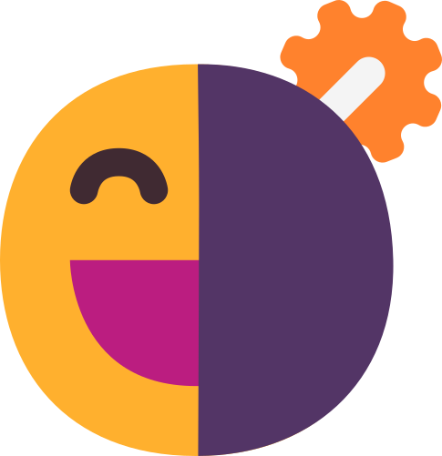
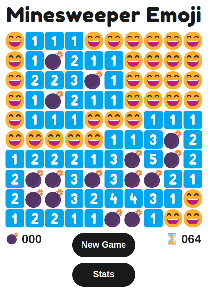
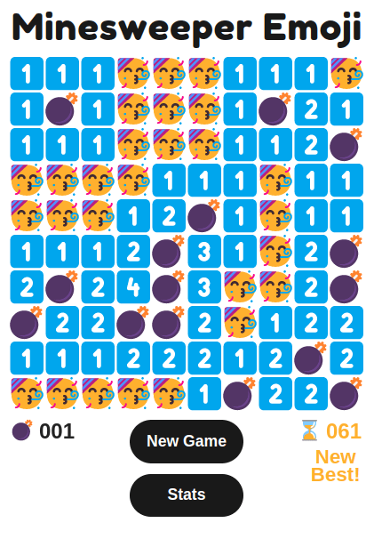
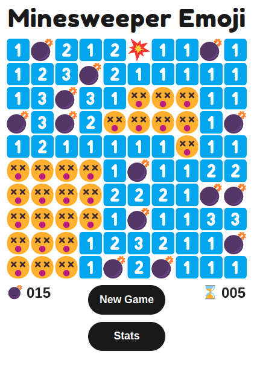
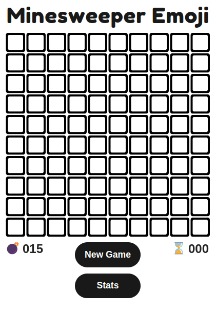
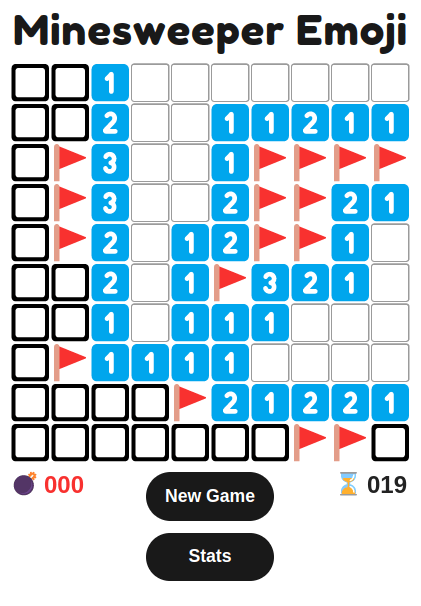
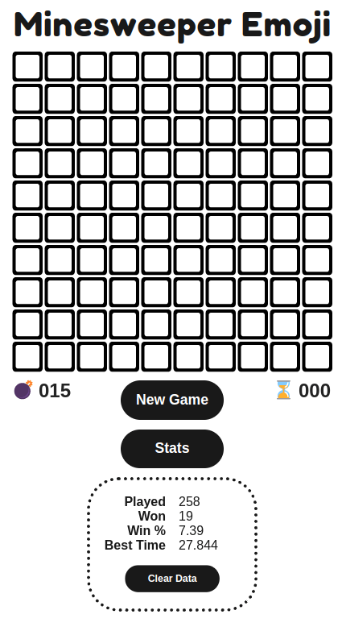
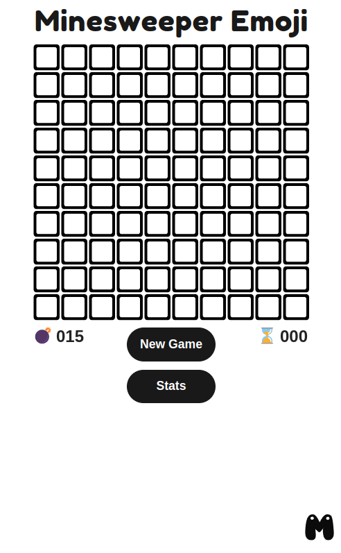

   
    
   

<h3 align="center">Minesweeper made with emojis and ❤️  <a target="_blank" href="https://minesweeper-emoji.netlify.app/">Play!</a><h3>

  
  
## Technologies Used

&nbsp;&nbsp;&nbsp;&nbsp;&nbsp;&nbsp;

&nbsp;&nbsp;&nbsp;&nbsp;&nbsp;&nbsp;

&nbsp;&nbsp;&nbsp;&nbsp;&nbsp;&nbsp;

[p5.js](https://p5js.org/)
 • 
[JavaScript](https://en.wikipedia.org/wiki/JavaScript)
 • 
[CSS](https://en.wikipedia.org/wiki/CSS)
 • 
[HTML](https://en.wikipedia.org/wiki/HTML)

  
## Description
**The classic Minesweeper game reimagined and implemented with emojis.**

The board is drawn inside a [canvas](https://developer.mozilla.org/en-US/docs/Web/API/Canvas_API) element, with the help of the p5.js library. The object-oriented JavaScript paradigm is used, as each Cell is an instance of the class Cell. The rest of the UI is handled using vanilla JavaScript.

***Coming Soon:*** We are currently building our server, which will give players the ability to create an account, save stats and get ranked among other players worldwide! The repository of the server can be found [here](https://github.com/mamarmar/minesweeper-emoji-server).

## Features
* Three levels: beginner, intermediate, expert
* Flower mode
* Stats for each level

### Mines
* Random mine allocation on load
* Ensure that the first click is never on a mine

### Flagging
* Ability to flag possible location of mines
* Revealed cells cannot be flagged
* Whenever a cell is revealed it stops being flagged

### Endgame
* Empty cells become a grinning face with smiling eyes if the game is won or a dizzy face if the game is lost
* Different emoji for detonated mine (the mine the player clicked) and revealed mines (the rest of the mines)
* Empty cells become and timer turns gold when the player has made a new best time
* Message informing that the player has made a new best time
* Wrongly flagged cells are marked with an X

### Indicators 
* Number of initial and remaining mines indicator
* Number of reamining mines becomes red if there are more flagged cells than the number of mines
* Timer indicator activated on first click and stopping on game end

### Stats
* Games played, games won, winning percentage, and best time are saved on local storage
* Seperate stats for the three levels (beginner, intermediate, expert)
* Stats panel containing the aformentioned values
* Stats panel smooth animation
* Checks for null values

### Other
* Board fade-in effect
* Animated header on hover
* Animated footer logo on hover
* Extensive commenting to make the project's code accessible for beginners

### Emojis
The following emojis are used throughout the game:

😄 😵 🥳 🔲 💣 💥 🚩 ❌ ⬜️ 1️⃣ 2️⃣ 3️⃣ 4️⃣ 5️⃣ 6️⃣ 7️⃣ 8️⃣ ⌛

The following emojis are used in flower mode only:

😊 😔 🌺 🐛

## Controls
* Left-click to reveal cell 
* Right-click to flag
* New Game button restarts the game
* Stats button toggles the stats panel 

### Keyboard
| Key           | Action                       |
| ------------- |:----------------------------:|
| Left Arrow    | Switch to Flower Mode        |
| Right Arrow   | Switch to Mine Mode          |
| 1             | Switch to Beginner Level     |
| 2             | Switch to Intermediate Level |
| 3             | Switch to Expert Level       |
  

## Screenshots:
  
#### Win

  
#### New Best Time

#### Loss  

#### Mistakes  

#### Idle  

#### More flags than mines

  
#### Stats panel

#### Full page

## License

Copyright (c) 2022 Michael Kolesidis 
Licensed under the [GNU General Public License v3.0](https://www.gnu.org/licenses/gpl-3.0.html).
