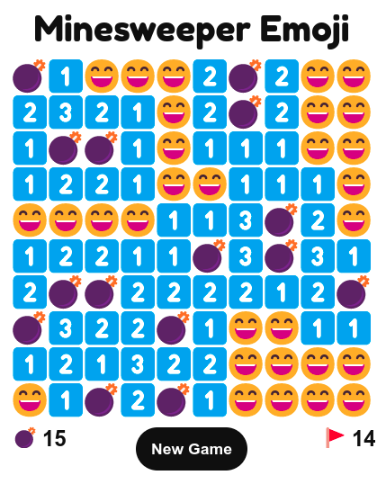
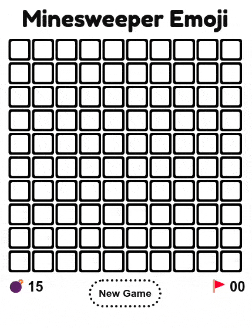
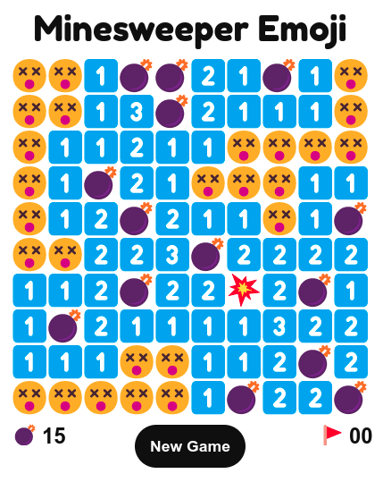
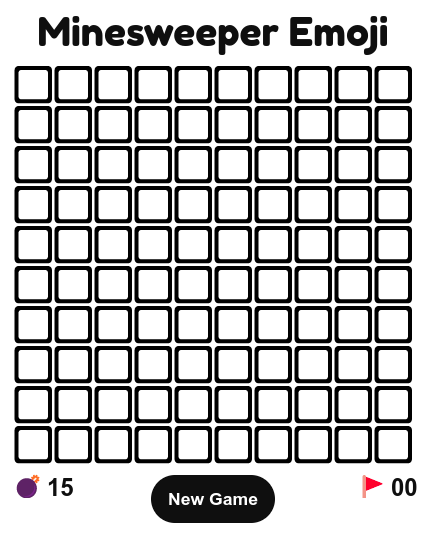
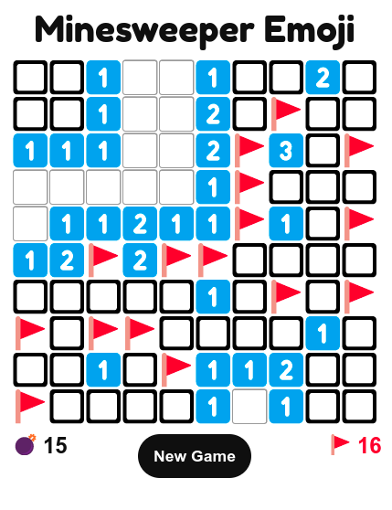

  
   
  

<h3 align="center">Minesweeper made with 😄 😵 💣 💥 🚩 and ❤️  <a target="_blank" href="https://minesweeper-emoji.netlify.app/">Try me!</a><h3>

  
  
## Technologies Used

&nbsp;&nbsp;&nbsp;&nbsp;&nbsp;&nbsp;

&nbsp;&nbsp;&nbsp;&nbsp;&nbsp;&nbsp;

&nbsp;&nbsp;&nbsp;&nbsp;&nbsp;&nbsp;

&nbsp;&nbsp;&nbsp;&nbsp;&nbsp;&nbsp;

  
  
## Description
The classic Minesweeper game reimagined and implemented with emojis. It is an example of object-oriented JavaScript: each Cell is an instance of the class Cell. Mines are allocated randomly on page load. 

The mine allocation used to be based on probability (ex. each cell had a 15% chance to be a mine) which made the total number of mines variable. It has since been redesigned, and now the total number of mines can be set in the code.
  
  

## Features
* Random mine 💣 allocation on load
* Ensure that the first click is never on a mine 💣
* Fixed (15) total number of mines 💣 (ability to change number of mines in code)
* Ability to flag 🚩 possible location of mines
* Empty cells become a grinning face with smiling eyes 😄 if the game is won or a dizzy face 😵 if the game is lost
* Different emoji for detonated mine 💥 and revealed mines 💣
* Number of mines 💣 and of flagged cells 🚩 indicators
* Number of flagged cells 🚩 becomes red if there are more flagged cells than the number of mines 💣
* Revealed cells cannot be flagged 🚩, and whenever a cell is revealed it stops being flagged

## Controls
  
* Left-click to reveal cell 
* Right-click to flag
* New Game button restarts the game

## Demo :
 
  

  
## Screenshots:
  
#### Win

  
#### Loss  

#### Idle  

#### More flags than mines

  
## To-do list
  
* ~~New Game button~~ 
* ~~Sane(r) mine allocation system~~
* ~~Ensure first click is not on a mine~~
* ~~Different emoji for detonated mine~~
* ~~Number of mines indicator~~
* ~~Number of flagged cells indicator~~
* Ability to choose number of mines
* Ability to choose board size
* Time counter
* Moves counter
* Mobile-friendly design

  
  
## Related Projects

[Tic-Tac-Toe](https://github.com/michaelkolesidis/tic-tac-toe)  
  
  
  
## License

Copyright (c) 2022 Michael Kolesidis 
Licensed under the [GNU General Public License v3.0](https://www.gnu.org/licenses/gpl-3.0.html).

 
 

[//]: # (Free Software)

   
   

  

                                                       

  

